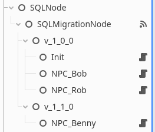

# Database Initialization and Migrations  

One of the key features of the GodotLighter library is the 
[`SQLMigrationNode`](../Migration/SQLMigrationNode.md), which handles database initialization 
and ensures seamless migration to newer versions.  

There are two node types involved in the migration process:  

- [`SQLMigrationScript`](../Migration/SQLMigrationNode.md): Represents a single migration script used to update the database.  
- [`SQLMigrationNode`](../Migration/SQLMigrationNode.md): Manages the overall migration process.  

## Initialization vs. Migrations  

GodotLighter provides two ways to utilize migration functionality, determined by the value of 
the [`SQLMigrationNode::is_one_time`](../SQLMigrationNode.md#is_one_time-bool) property. 

1. **One-time database setup (`is_one_time = true`)**  
   - Used to set up a database once, typically for cases where persistence is unnecessary (e.g., an in-memory database used only during runtime).  
   - `SQLMigrationNode` expects a new, empty database each time it runs, so no migration log table is created.  

2. **Database with a migration log (`is_one_time = false`)**  
   - Allows `SQLMigrationNode` to be executed multiple times on the same database.  
   - Maintains a migration log table to track which `SQLMigrationScript` nodes have already been executed, ensuring that only pending migrations run.  
   - Example use case: for preserving the database between game runs and automatically applying updates when a new game version is released, keeping older save files compatible.  

The chosen functionality and how migrations are handled depend on the `is_one_time` property, making it a key factor in determining whether the database operates as a temporary instance or a persistent, version-controlled system.

## Setting Up

Here is an example of a simple structure:

Is this example the nodes are,

| Node                                         | Type                                                        | Description                                                                                                                                                                                                                                        |
|----------------------------------------------|-------------------------------------------------------------|----------------------------------------------------------------------------------------------------------------------------------------------------------------------------------------------------------------------------------------------------|
| `SQLNode`                                    | [`SQLNode`](../SQLNode.md)                                  | This is the database node                                                                                                                                                                                                                          |
| `SQLMigrationNode`                           | [`SQLMigrationNode`](../Migration/SQLMigrationNode.md)      | This is the migration node                                                                                                                                                                                                                         |
| `v_1_0_0` and `v_1_1_0`                      | `Node`                                                      | These two are simple nodes and there only purpose is to seperate the scripts that we used in our first version of the game from the changes introduced in version v_1_1_0                                                                          |
| `Init`, `NPC_Bob`, `NPC_Rob` and `NPC_Benny` | [`SQLMigrationScript`](../Migration/SQLMigrationScript.md)  | This are the migration script nodes that will run when the migration process is triggered. Each one must have a script file attached to it with the [`_update`](../Migration/SQLMigrationScript.md#_updatenode-sqlnode-void) method implemented.   |

When the migration process is triggered, `SQLMigrationNode` will traverse all its children and 
grandchildren, searching for any `SQLMigrationScript` nodes.

If running in `is_one_time = true` mode, all found scripts will be executed sequentially.

If `is_one_time` is set to `false`, `SQLMigrationScript` will first attempt to create the 
log table if it does not already exist. The table name can be configured by modifying the 
[`migration_table`](../Migration/SQLMigrationNode.md#migration_table-string) property. 
Next, the migration process retrieves the list of scripts that have already been applied from the
log table.

The migration node then compares the discovered script nodes with the entries in the log table.
Only scripts that are not present in the log table will be executed. After executing each script, 
it is logged into the table before proceeding to the next one. This ensures that if a script 
fails, the next migration attempt will resume from the failed script.

If the log table and the script list are identical, no scripts will be executed, and the
migration will be considered successful.

The execution order follows the order of the child nodes. In the example shown in the image,
the scripts will execute in the following sequence:

1. `v_1_0_0/Init`
2. `v_1_0_0/NPC_Bob`
3. `v_1_0_0/NPC_Rob`
4. `v_1_1_0/NPC_Benny`

